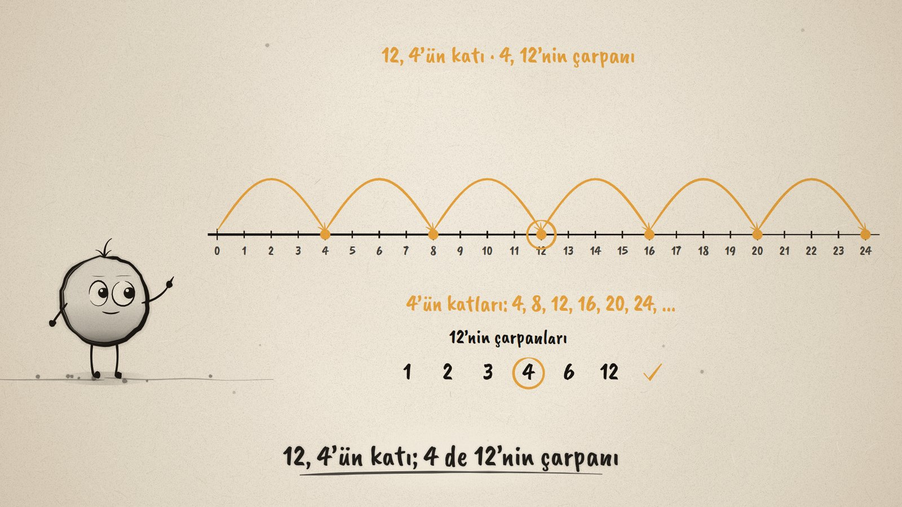
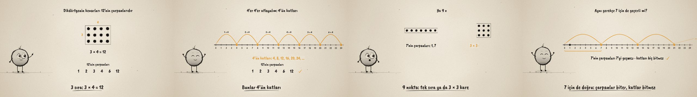

# Çarpan mı, Kat mı? · Factors and Multiples

**▶ Tarayıcıda izleyin / Watch in the browser:** https://hakanatas.github.io/carpan-mi-kat-mi/ 
**⬇ MP4 + altyazılar / MP4 + subtitles:** [Releases](https://github.com/hakanatas/carpan-mi-kat-mi/releases) 
**✎ Kullanılan istem / The prompt behind it:** [PROMPT.md](PROMPT.md) 
**🎞 Bütün filmler / All films:** [Nokta'nın Filmleri](https://hakanatas.github.io/nokta-filmleri/?sinif=6)

> **TR —** 6. sınıf matematik "Sayılar ve Nicelikler" temasındaki MAT.6.1.1 öğrenme çıktısı için hazırlanmış, tamamen JavaScript ile çizilen 92 saniyelik mürekkep animasyonu. 12 nokta dikdörtgenler hâlinde diziliyor: 1 × 12, 2 × 6, 3 × 4. Kenar uzunlukları 12'nin çarpanları oluyor; "5 de çarpan olabilir mi?" varsayımı 2 nokta arttığı için çürüyor. Sayı doğrusunda 4'er 4'er atlanınca 4'ün katları çıkıyor ve 12 ikisinde de görünüyor: 12, 4'ün katı; 4, 12'nin çarpanı. 7 ve 9 noktayla bir önerme ve gerekçesi kuruluyor: 1 ve sayının kendisi her zaman çarpandır, çünkü her sayı tek sıra dizilebilir. Son olarak çarpanların sınırlı, katların sonsuz olduğu 12 ve 4 için gösteriliyor, aynı gerekçenin 7 için de geçerli olduğu kontrol ediliyor. Altyazılar Türkçe, İngilizce ya da ikisi birlikte seçilebilir.

A 92-second ink animation for **6th-grade maths**, drawn entirely with JavaScript on an HTML5 canvas. It is the first film of the 6th grade and opens the *Sayılar ve Nicelikler* theme. Nokta, the ink character from [The Learning Ink](https://github.com/hakanatas/the-learning-ink), is the guide again. The dot arrays are not keyframed by hand: each array is a list of `[time, dots per row]` keys, and every dot's position is computed from it (`array` in `src/draw/film.js`), so a leftover dot turns amber on its own.

## Learning outcome

MEB, Türkiye Yüzyılı Maarif Modeli, Ortaokul Matematik, 6th grade, "Sayılar ve Nicelikler" theme:

**MAT.6.1.1. Karşılaştığı problem durumlarında bir doğal sayının çarpan ve katlarına yönelik muhakeme yapabilme**
- a) Karşılaştığı durumlarda bir doğal sayının çarpan ve katlarına yönelik varsayımlarda bulunur.
- b) Varsayımına yönelik örnek durumların içerdiği ilişkileri inceleyerek bir doğal sayının çarpan ve katlarına ilişkin genellemeleri belirler.
- c) Elde ettiği genellemelerin varsayımını karşılayıp karşılamadığını çeşitli modellerle gösterir.
- ç) Varsayımı ile ilgili ulaştığı sonuca yönelik doğrulayabileceği matematiksel bir önermeyi sözel ya da sembolik temsil ile sunar.
- d) Farklı problemlerin pratik yoldan çözümüne yönelik oluşturduğu önermenin gerekçelerini sunar.
- e) Önermenin geçerliliğini destekleyen kapsayıcı örnekler verir.
- f) İşe koştuğu doğrulamanın benzer önermelere uygulanıp uygulanamayacağını değerlendirir.

## Scenes

| # | Time | Scene | What happens | Outcome |
|---|---|---|---|---|
| 1 | 0–10 s | On iki nokta | 12 dots fall into a pile: how many rectangles can they make? | a |
| 2 | 10–30 s | Dikdörtgenler | 1 × 12, 2 × 6, 3 × 4: the sides are the factors. Rows of 5 leave 2 over, so 5 is not a factor. | a, c |
| 3 | 30–46 s | Katlar | Jumps of 4 on a number line: 4, 8, 12, 16, 20, 24. 12 is a multiple of 4 and 4 is a factor of 12. | b, c, ç |
| 4 | 46–64 s | Önerme ve gerekçe | 7 dots make only one row; 9 dots make a row or a 3 × 3 square. Claim: 1 and the number itself are always factors, because every number fits in one row. | ç, d, e |
| 5 | 64–80 s | Sınırlı mı, sonsuz mu? | The factors of 12 stay at or below 12; the multiples of 4 never end. The same reasoning is checked for 7. | b, e, f |
| 6 | 80–92 s | Aklında kalsın | 3 × 4 = 12: 3 and 4 are factors of 12, 12 is a multiple of 3 and of 4. Factors are few, multiples are endless. | ç |

## Running it

- **Preview:** double-click `index.html` (it works offline).
- **MP4:** run `npm install` once, then `npm run export -- --format=horizontal --captions=tr`.
- **Subtitles and narration:** `npm run srt` writes `out/captions_*.srt` and `narration_notes.txt`.
- **Editing:**
  - Caption text, timings and narration notes: `captions.js`
  - Everything on screen is drawn by `LI.world(t)` in `scenes/scene1.js` (the arrays and their key lists `K12`, `K7`, `K9`, the factor list, the number line, the claims); the other scenes only set the camera.
  - Dot arrays, number line, jumps and Nokta's poses: `src/draw/film.js`; layout for 16:9 and 9:16: `src/draw/kd.js`

It uses the same engine as The Learning Ink: `renderFrame(t)` as a pure function of time, seeded randomness, and frame-by-frame export.
